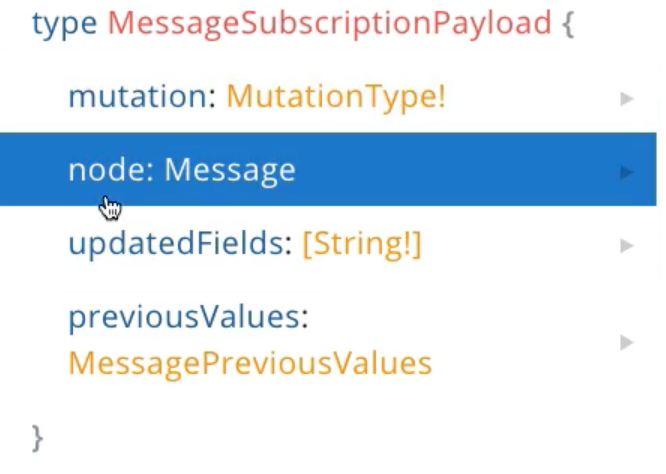
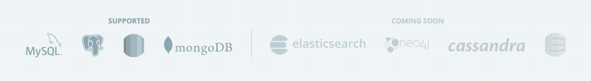
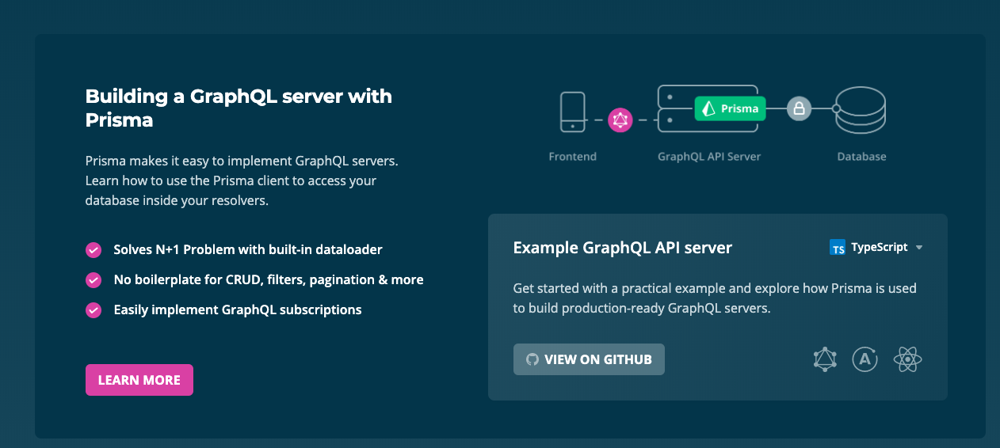

## Conclusion

- node 받는것을 추가해 주어야 한다.
- payload는 message만 가지고 있지 않고 subscription payload도 가지고 있다.
- subscription payload는 다음과 같은 것들을 리턴할 수 있다
  
  

  ~~~javascript
  resolve: payload => payload
  ~~~

  newMessage.js의 마지막 부분인 위 코드처럼 하면 위의 4가지를 전부 다 받을 수 있다.
  하지만 node만 필요하기 때문에 .node()를 붙여 주었다.

newMessage를 실행해 보겠다.

- Client side query
~~~json
subscription {
  newMessage(roomId:"ck7j27gpgczck0984xqkr85px"){
    id
  }
}
~~~

-> listening 중

- Client side query
~~~json
mutation {
  sendMessage(roomId: "ck7j27gpgczck0984xqkr85px", message: "Hi gerrit!") {
    id
  }
}

~~~

- subscription result
~~~json
{
  "data": {
    "newMessage": {
      "id": "ck7nft44k027h0a48xu0hj8xw"
    }
  }
}
~~~

message를 하나 받은것을 볼 수 있다. 그리고 아직 listening 중이다.
만약 roomId를 다른 방의 id로 하여 msg를 보낸다면 update 되지 않는다. subscription 중이지 않기 때문에

참고로 prisma는 API를 비어있는 database 에서 만들 수 있는것 뿐만 아니라 존재하는 database에서도 API를 만들 수 있다.
이것이 prisma의 장점이다.
새로운 database 분만 아니라 기존의 database도 가능하다. 그 database를 받아들여서 API를 제공해 줄 것이다.

prisma는 typescript로 되어있다. javascript는 실수를 해도 error를 알려주지 않는데 typescript는 알려주어서 장점이다.

보다시피 prisma는 mysql, postgreSQL, dynamo, mongoDB에서 작동한다.
이미 database가 있다면 prisma를 시작해도 prisma가 이해할 것이라 중요하지 않다.

GraphQL API 뿐만 아니라 REST API도 가능하다.

이 경우 graphQL을 리턴하는 것 보다, json 파일 전체를 리턴한다.

또한 render 하기 위해 spock을 사용할 수 있다.
prisma에 있는 data가 무조건 graphQL 일 필요없다. 기능성 자체가 있는게 중요하다.